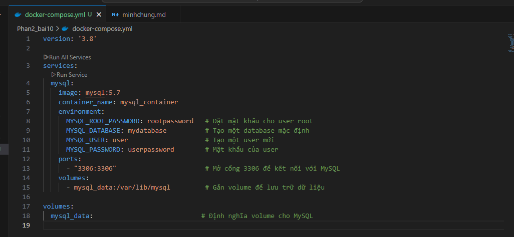
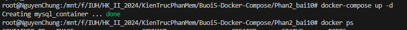
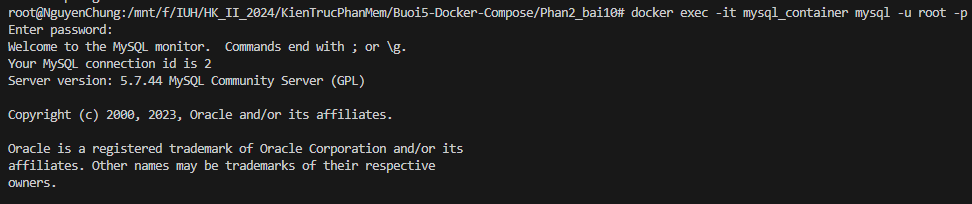
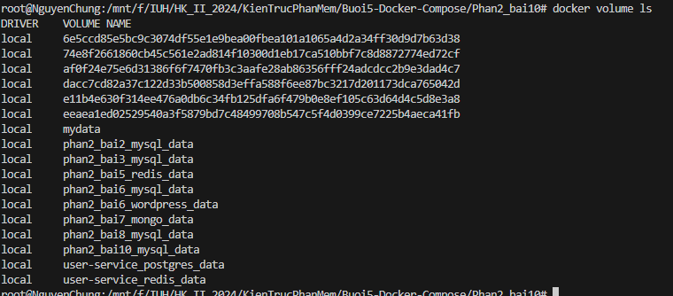

1. Tạo docker-compose
   
2. Chạy compose

```
docker-compose up -d
```



3. Kết nối vào MySQL trong container:

```
docker exec -it mysql_container mysql -u root -p
```

Password: rootpassword



4. Kiểm tra Docker Volumes
   

Xem chi tiết

```
docker volume inspect mysql_data
```
