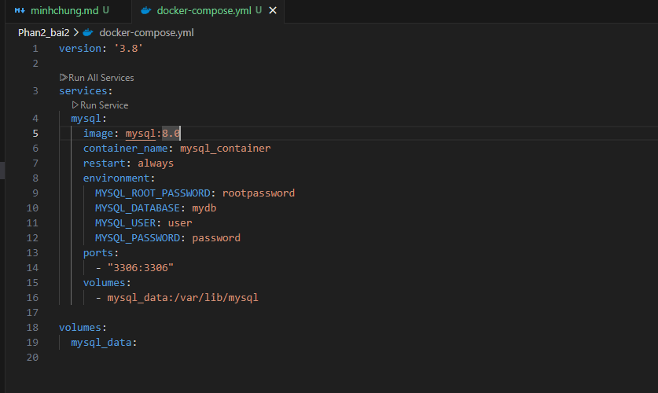
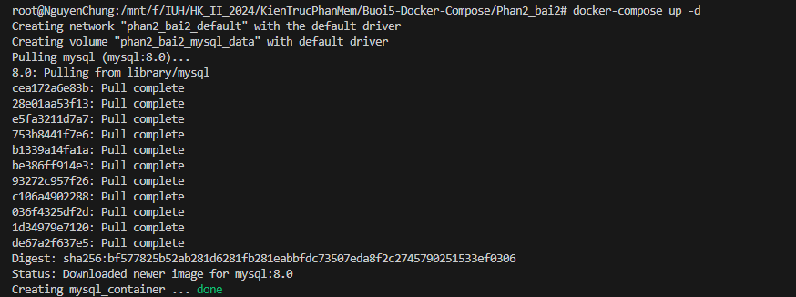
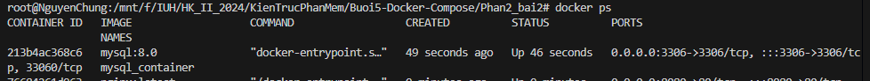
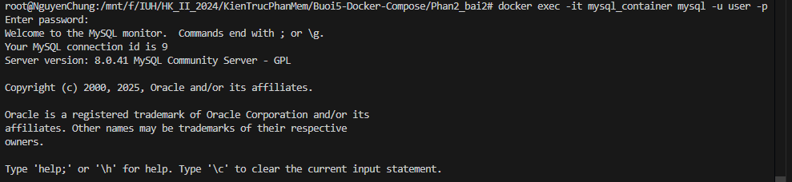
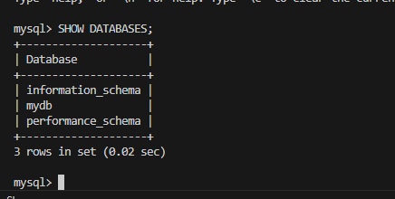

### Minh Chung

1. Tạo tệp docker-compose.yml
   

2 Chạy container

```
docker-compose up -d
```



3 Xem

```
docker ps
```


4 Kết nối MySQL

```
docker exec -it mysql_container mysql -u user -p
```



5 Show Database Thành công

