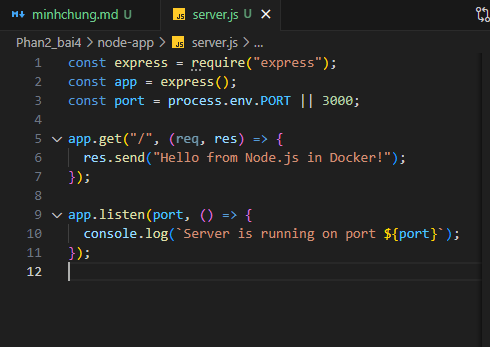
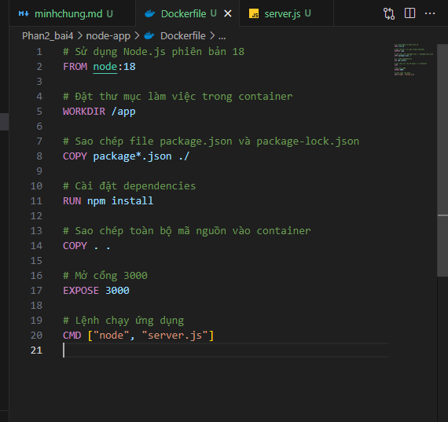
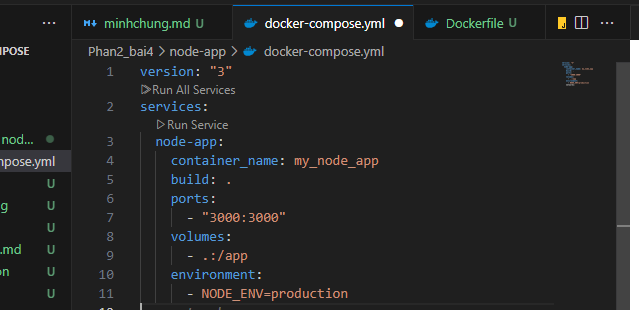
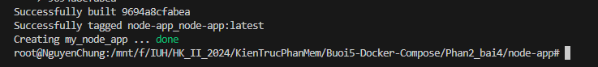
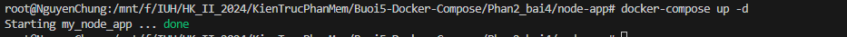
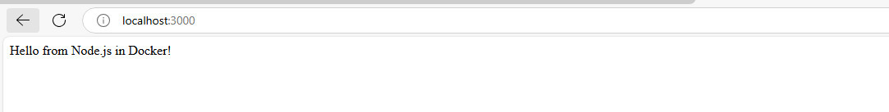

1. Tạo thư mục node-app
2. Tạo server.js
   
3. Tạo package.json và cài express

```
npm init -y
```

```
npm install express
```

4. Tạo file Dockerfile trong thư mục node-app với nội dung sau



5. Tạo file docker-compose.yml trong thư mục node-app với nội dung sau:
   
6. Chạy Ứng Dụng

```
docker-compose up -d --build
```



7. Kiểm Tra Ứng Dụng

Nếu chưa thành công hãy chạy lại:

```
docker-compose up -d
```



##### Kết quả


