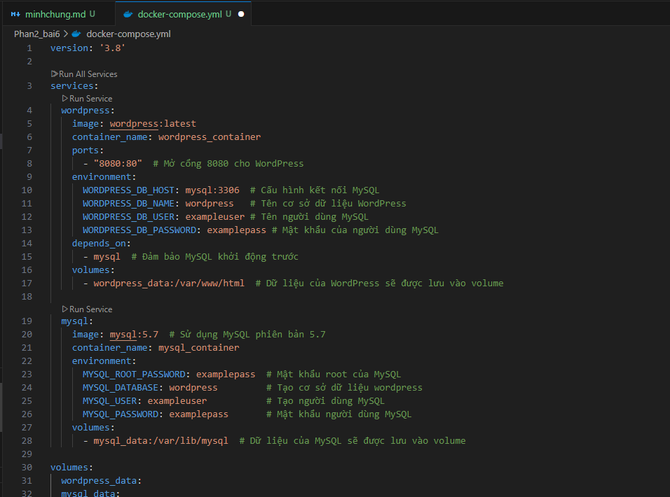
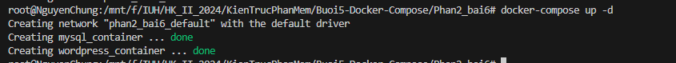
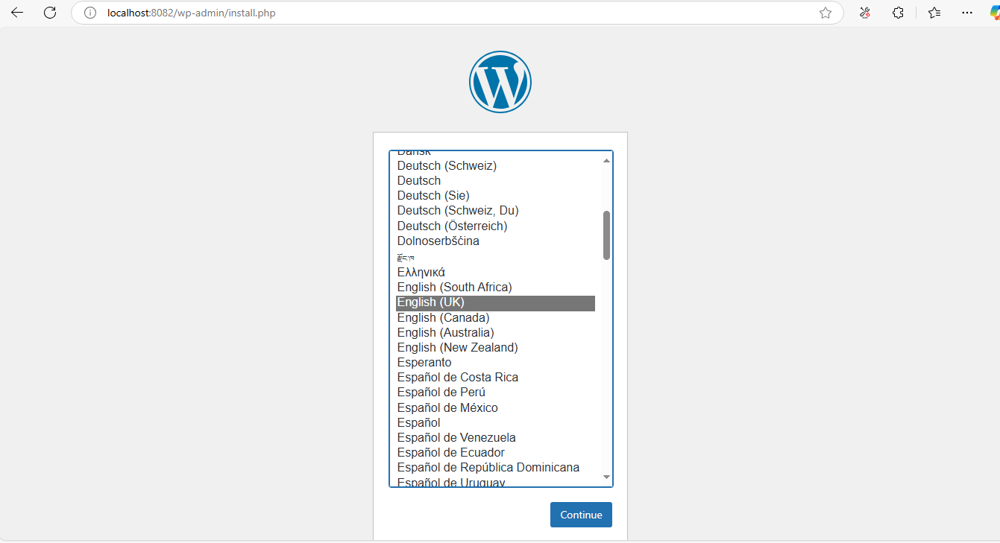

1. Tạo một file docker-compose.yml với cấu hình cho WordPress và MySQL. File này sẽ cấu hình cả 2 dịch vụ, WordPress và MySQL, cùng với các thông số cần thiết.
   

2. Chạy compose

```
docker-compose up -d
```

 3. Chạy local : 8082


