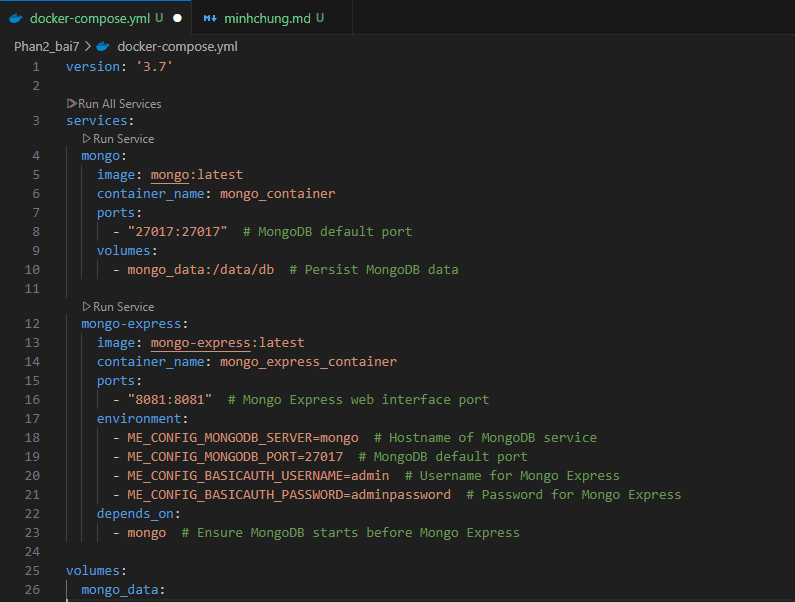
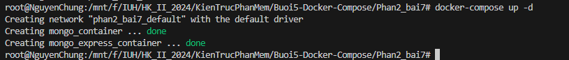
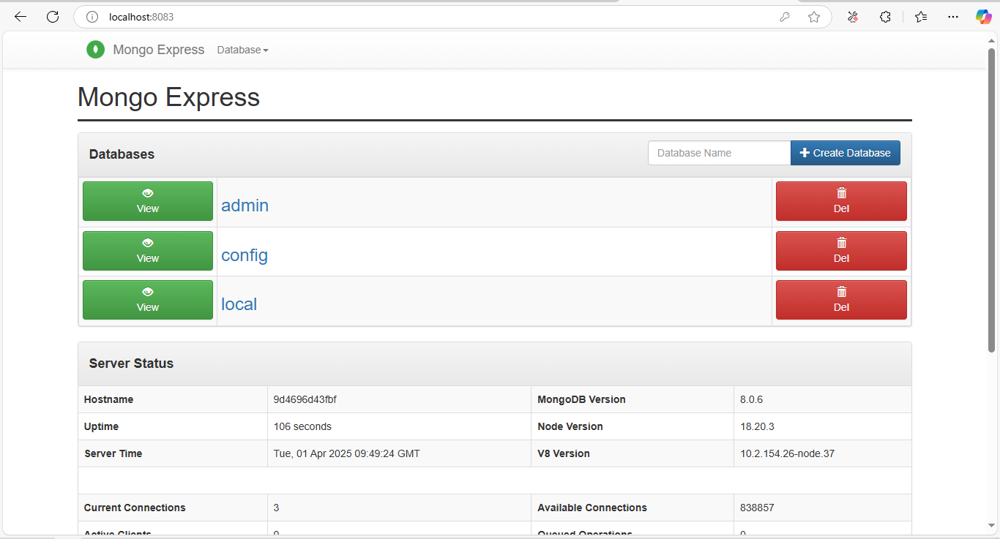

1. Tạo file docker-compose.yml
   
2. Chạy Docker Compose

```
docker-compose up -d
```

 3. Truy cập Mongo Express
Sử dụng tài khoản đã cấu hình trong phần environment của Mongo Express:

Username: admin

Password: adminpassword


