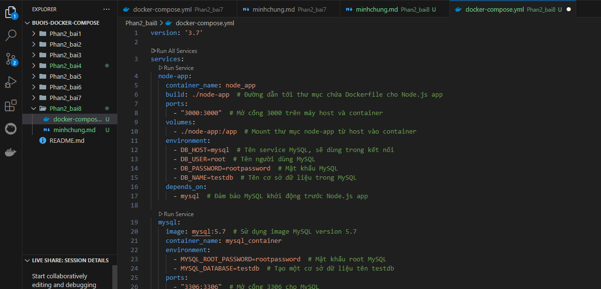
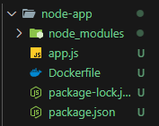
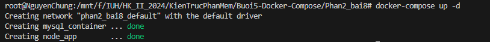
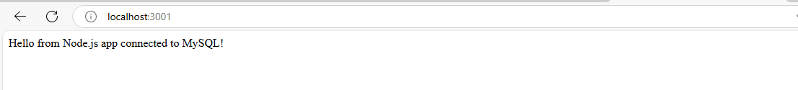
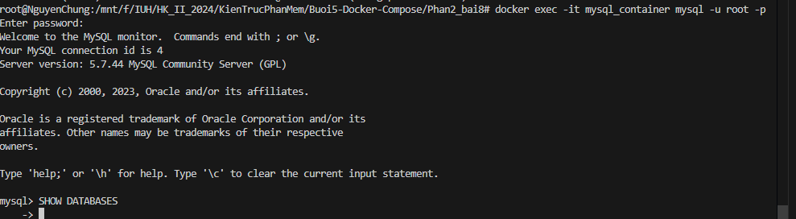

1. Tạo một file docker-compose.yml với nội dung sau:
   

2. Tạo ứng dụng Node.js
   
3. Chạy Docker Compose

```
docker-compose up -d
```

 4. Truy cập Node js mở host:3001
 5. Kiểm tra kết nối MySQL

```
docker exec -it mysql_container mysql -u root -p

```

Nhập mật khẩu rootpassword để kiếm tra testdb:

```
SHOW DATABASES;
USE testdb;

```



DỪng dịch khi không dùng

```
docker-compose down

```
