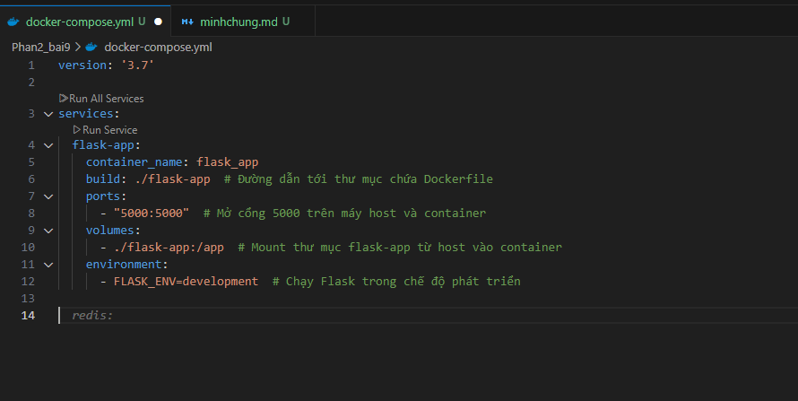
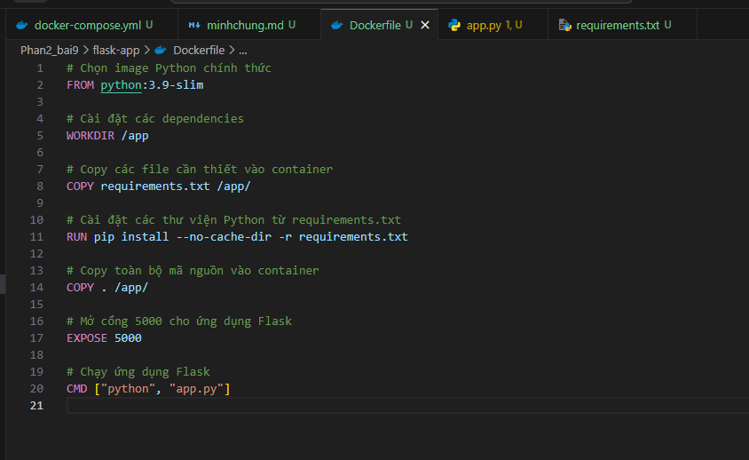
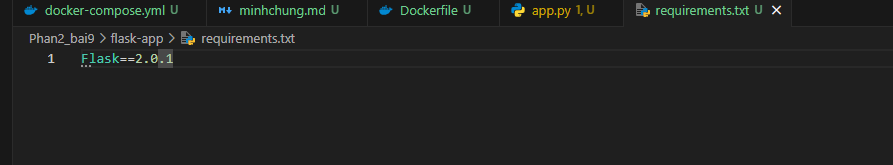
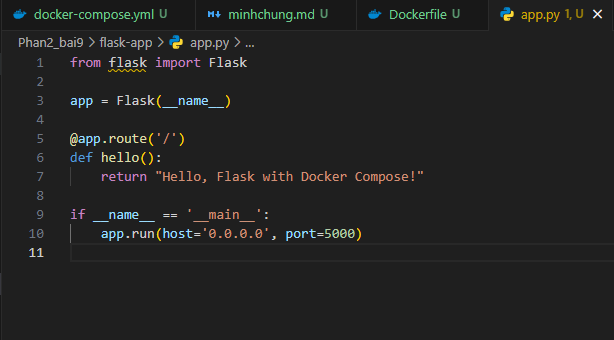
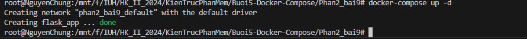
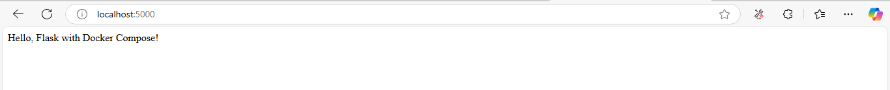

1. Tạo cấu trúc thư mục cho dự án Flask
   .
   ├── docker-compose.yml
   └── flask-app/
   ├── Dockerfile
   ├── requirements.txt
   └── app.py
2. Tạo docker-compose
   

3. Tạo ứng dụng Flask
   Tạo Dockerfile
   
   requirements.txt
   
   app.py
   

4. Chạy Compose
   

5. Chạy local: 5000
   
