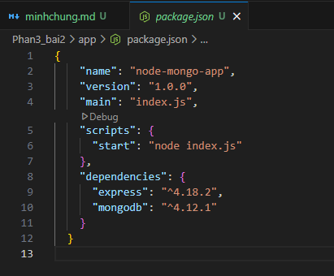
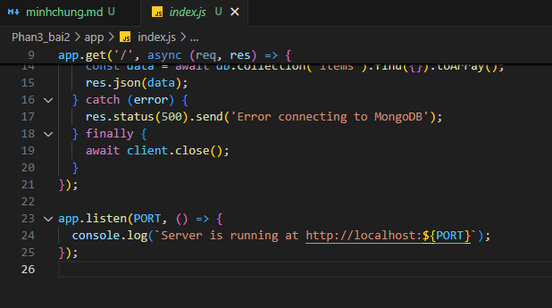
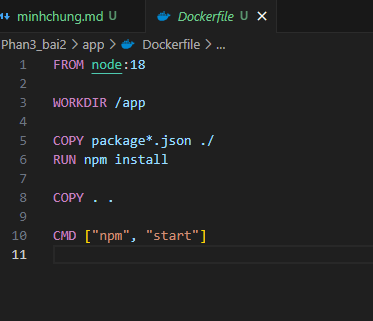
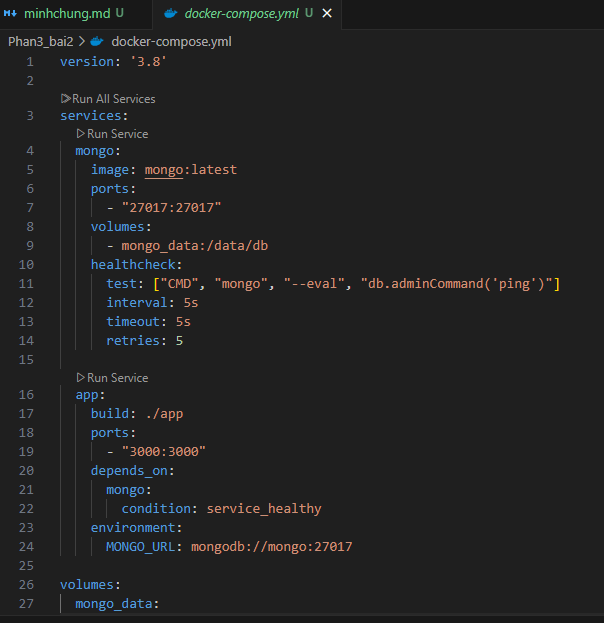
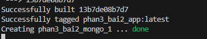

## Bài tập 2: Node.js + MongoDB

1. Cấu trúc thư mục
   phan3_bai2/
   ├── app/
   │ ├── Dockerfile
   │ ├── package.json
   │ └── index.js
   ├── docker-compose.yml

2. Tạo package.json
   

3. Tạo index.js
   

4. DockerFile
   

5. Docker-compose
   

6. Chạy

```
docker-compose up -d --build
```



7. Chạy localhost:3000
