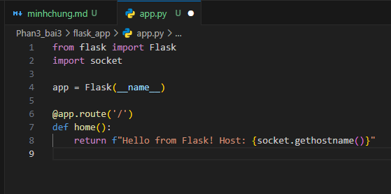
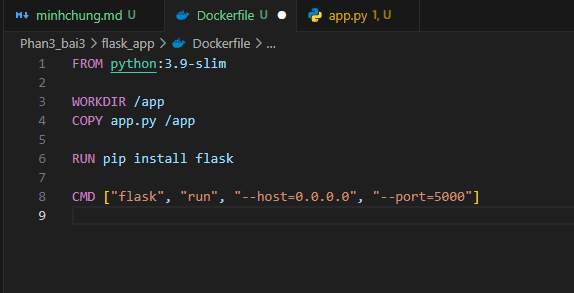
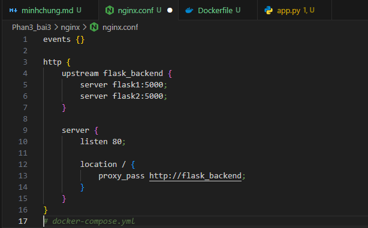
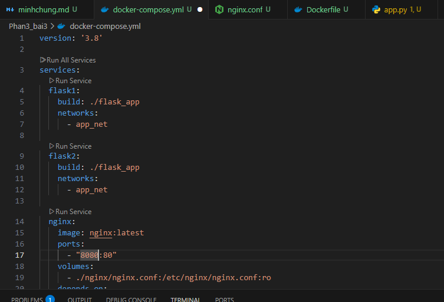
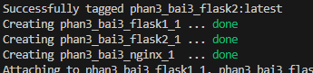
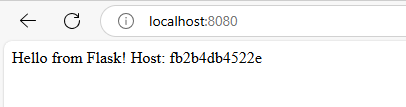

## Bài tập 3: Load Balancing với Nginx + Flask

1. Cấu trúc
   Phan3_bai3/
   ├── docker-compose.yml
   ├── flask_app/
   │ ├── app.py
   │ └── Dockerfile
   └── nginx/
   └── nginx.conf

2. flask_app/app.py
   
3. flask_app/Dockerfile



4. nginx/nginx.conf
   

5. docker-compose.yml
   

6. Chạy

```
docker-compose up --build
```



8. localhost:8080
   
