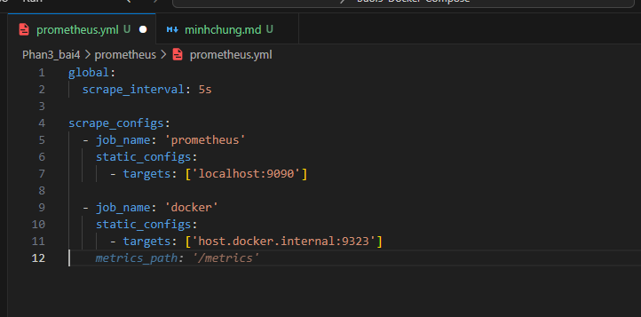
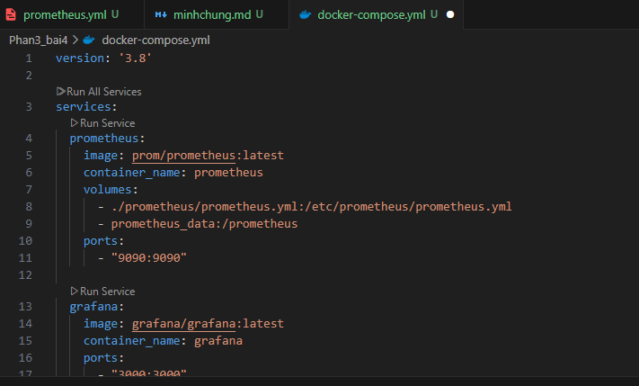
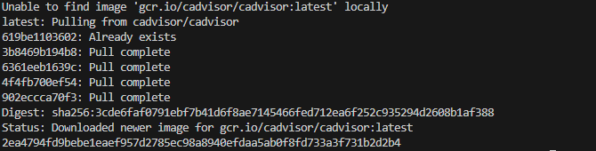
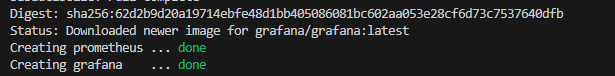
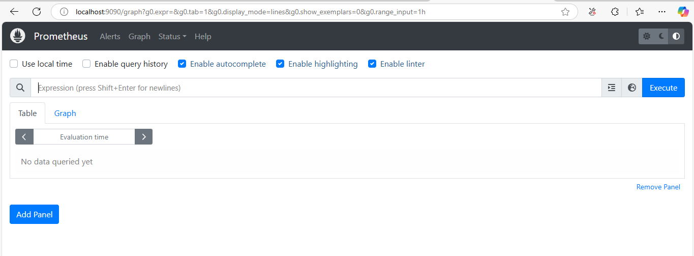
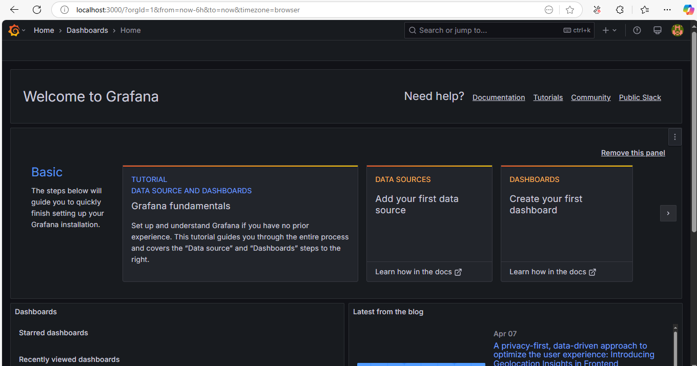

## Bài tập 4: Prometheus + Grafana Monitoring với Docker Compose

1. Cấu trúc
   phan3_bai4/
   ├── docker-compose.yml
   ├── prometheus/
   │ └── prometheus.yml

2. prometheus/prometheus.yml
   

3. docker-compose.yml
   

4. Cài đặt Docker Metrics Exporter

```
docker run -d \
  -p 9323:9323 \
  --name cadvisor \
  --volume=/:/rootfs:ro \
  --volume=/var/run:/var/run:ro \
  --volume=/sys:/sys:ro \
  --volume=/var/lib/docker/:/var/lib/docker:ro \
  gcr.io/cadvisor/cadvisor:latest

```



5. Chạy

```
docker-compose up -d
```



6. Truy cập
   Prometheus: http://localhost:9090
   

Grafana: http://localhost:3000
→ Username: admin | Password: admin (mặc định lần đầu)


7. Cấu hình Grafana
   Đăng nhập vào Grafana.

   Add Data Source → Prometheus.

   URL: http://prometheus:9090.

   Save & Test.

   Import Dashboard (có thể dùng ID 1860 – Docker & system metrics).
