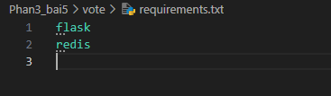

## Bài tập 5: Multi-tier Voting App

1. Cấu trúc
   phan3_bai5/
   ├── docker-compose.yml
   ├── vote/
   │ └── app.py
   │ └── requirements.txt
   ├── result/
   │ └── server.js
   │ └── package.json
   ├── worker/
   │ └── Worker.java
   │ └── Dockerfile

2. docker-compose.yml
   
3. vote/app.py
   
4. vote/requirements.txt
   
5. DockerFile
   
6. result/server.js
   
7. result/package.json
   
8. DockerFile trong result
   
9. worker/Worker.java
   
10. worker/Dockerfile
    

11. Tạo bảng trong Postgres (khi container chạy lần đầu)

```
docker exec -it <db_container_id> psql -U postgres -d votes
```

    Tạo bảng:
    ```
      CREATE TABLE votes (
        id SERIAL PRIMARY KEY,
        vote TEXT NOT NULL
        );
    ```

12. Chạy toàn bộ hệ thống

```
docker-compose up --build -d
```

13. Truy cập ứng dụng
    Giao diện Vote (Flask): http://localhost:5000

        Kết quả (Node.js): http://localhost:5001
